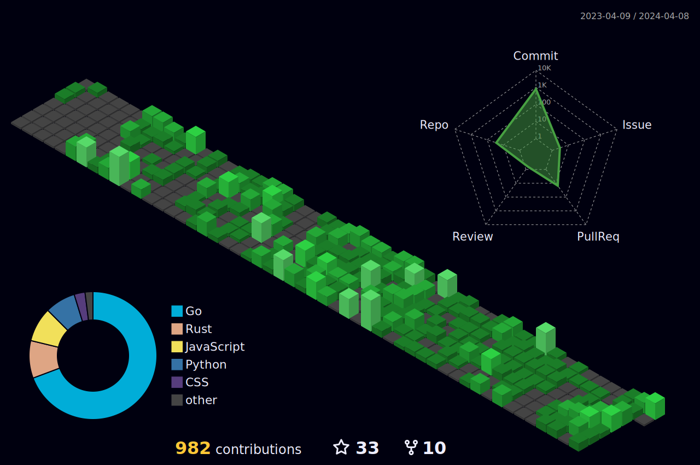

### Hi there 👋

Software engineer with well-developed analytical, troubleshooting, and problem-solving skills. Proficient in multiple programming languages and technologies, I possess a strong understanding of software development principles and a proven track record of delivering high-quality solutions.

My main expertise lies in the Perl programming language. This language has provided me with great opportunities to work on large-scale projects and experience rapid growth.

I have production experience with writing services in languages Python and TypeScript, but I wouldn't call myself an expert :)

Currently, I'm improving my knowledge in GoLang and Rust and looking forward to applying it to open-source projects. Let me know if you need a hand.

<!--
**ksysoev/ksysoev** is a ✨ _special_ ✨ repository because its `README.md` (this file) appears on your GitHub profile.

Here are some ideas to get you started:

- 🔭 I’m currently working on ...
- 🌱 I’m currently learning ...
- 👯 I’m looking to collaborate on ...
- 🤔 I’m looking for help with ...
- 💬 Ask me about ...
- 📫 How to reach me: ...
- 😄 Pronouns: ...
- ⚡ Fun fact: ...
-->
